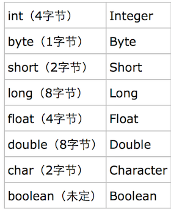

# 1 String StringBuffer和StringBuilder
## 可变性
1. String**不可变**（Immutable）用 `final`修饰字符数组：`private final char value[]`
   > Java9后换成了`byte`数组：`private final byte[] value`

   
   - String 不可变不代表其引用不可变

    ```java
    String s = "Hello";
    s +=  "world"; //s指向了一个新的内存地址
    ```
    原来指向"Hello"的内存地址转为指向"Hello World"的内存地址，也就是说多开辟了一块内存区域给"Hello World"字符串。
2. StringBufer和StringBuilder继承自 `AbstractStringBuilder`，无`final`关键字，可变类

## 线程安全
1. String 线程安全
2. StringBuffer有同步锁，线程安全，内部使用`synchoronized`
3. StringBuilder线程不安全，没有同步锁
## 性能
1. String效率低，每次该改变String都生成一个新的String对象
2. StringBuffer和StringBuilder对对象本身操作，StringBuilder性能比StringBuffer高，但线程不安全
## 使用总结
1. String：操作少量数据
2. StringBuffer：**多线程**操作字符串缓冲区下操作大量数据
3. StringBuilder：**单线**程操作字符串缓冲区下操作大量数据

# 2 装箱与拆箱
1. 装箱：将基本类型用对应的引用类型包装起来
2. 拆箱：将包装类型转换为基本数据类型
   ```java
    Integer i = 10； //装箱
    int n = i; //拆箱
   ```
   [装箱与拆箱](https://www.cnblogs.com/wang-yaz/p/8516151.html)

   

   
# 3 接口与抽象类
## 相同点
1. 都不能被实例化
2. 接口的实现或抽象类的子类都只有实现了接口或抽象类中的方法后才能被实例化
## 区别
1. 接口的方法默认是`public`，方法在接口中不能有实现（Java8开始方法可以有默认实现），抽象类可以有非抽象的方法，可以用`public、protect和default`修饰，jdk9接口引入了私有方法和私有静态方法。
2. 接口成员变量只能为`static、final`变量，抽象类不一定
3. 一个类可以实现多个接口，但只能继承一个抽象类  

# 4 `==、equals()和hashCode()`
1. `==` 判断两个对象的地址是否相等。即，判断两个对象是不是同⼀个对象(基本数据类型
==⽐较的是值，引⽤数据类型==⽐较的是内存地址)
2. `equals()`   
   1. 该方法由`Object`类提供，如果类没有覆盖 `equals()` 则等价于`==`
   2. 覆盖该方法，例如`String`,可实现自己的功能，比较对象的内容是否相等
3. `hashCode()` 继承自`Object`，返回对象在内存中地址转换成的`int`值，如果不重写该方法，则所有对象的`hashCode()`都不相等
### `equals() 和hashCode()`的规定
1. 如果两个对象相等，则`hashcode`一定相同
2. 两个对象相等，则两个对象分别调用`equals`都返回true
3. 两个对象`hashCode`相同，它们也不一定相等
4. 如果`equals`⽅法被覆盖过，则`hashCode`⽅法也必须被覆盖

# 5 关键字
## volatile
jvm提供的轻量级的同步机制
1. 类型修饰符，被`volatile`修饰的变量，系统每次用到它都直接从对应的内存中提取，不使用缓存。
2. 不能保证操作的原子性，不能替代`sychronized`，尽量不要使用。
三个特性：
1. 保证可见性
2. 不保证原子性
3. 禁止指令重排

## final
1. 属性
   
   属性引用不可变，只能指向初始化的那个对象，不关心对象内容的变化
   ```java
   final StringBuffer s = new StringBuffer("Hello");
   s.append(" world"); //可以通过编译
   s = new StringBuffer("hello world"); //编译期间错误
   ```
2. 方法
   
   方法不能被子类重写，子类可以使用。
   private 方法隐式地被指定为 final，如果在子类中定义的方法和基类中的一个 private 方法签名相同，此时子类的方法不是重写基类方法，而是在子类中定义了一个新的方法。
3. 参数

   表明该参数在函数内部不允许被修改。
4. 类
   
   不允许被继承
## finally
   用在`try/catch`中，不管程序是否异常，`finally`中的代码一定会执行，经常用于释放资源。

   `finally`块不被执行的特例

   1. 前面的代码中用了`System.exit(int)`已退出程序。`exit`是带参函数；如该语句在异常语句之后，`finally`会执行。
   2. 程序所在的线程死亡。
   3. 关闭 CPU.
   4. `finally`块第一行发生了异常。
   
   **注意**：当`try`和`finally`中都有`return`语句时，`finally`会在方法返回前执行，并覆盖原始的返回值。
   ```java
   //f()永远返回 -1
   int f(int v){
       try{
           return v;
       }finally{
           return -1;
       }
   }
   ```
## finalize
`Object`中的方法，再GC前调用对象的`finalize()`方法。
## static
1. 静态变量，变量属于类的，类的所有实例共享该变量，在内存中只存在一份。
2. 静态方法   
   - 在类加载时就存在了，不依赖任何实例，所以**静态方法必须有实现**，不能是抽象方法。
   - 只能访问类的**静态字段**和**静态方法**，方法中不能有`this和super`关键字，因为他们与具体的对象关联。
3. 静态代码块，静态语句块在类初始化时运行一次。
4. 静态内部类
  可以不依赖实例对象而被实例化，只能访问外部类的**静态成员**和**静态方法**（包括私有类型）。
5. 静态导包 `import static`   
   指定导入某个类中的指定静态资源，并且不需要使用类名调用类中静态成员，可使用静态成员变量和静态方法
   ```java
   import static java.lang.Math.*; //静态导包，import static java.lang.Math.max;也可以

   ...
    int max = max(1, 2); // 直接使用max()方法，不用Math.max().
   ...
6. 存在继承的情况下，初始化顺序：
   - 父类（静态变量、静态代码块）
   - 子类（静态变量、静态代码块）
   - 父类（实例变量、普通代码块）
   - 父类（构造函数）
   - 子类（实例变量、普通代码快）
   - 子类（构造函数）
## transient
阻⽌实例中那些⽤此关键字修饰的的变量序列化；当对象被反序列化时，
被 transient 修饰的变量值不会被持久化和恢复。transient 只能修饰变量，不能修饰类和⽅法。
# 6 深拷贝 浅拷贝 （`clone()`方法）
1. 浅拷贝：对基本数据类型值传递，引用数据类型引用传递。
2. 深拷贝：对基本数据类型进⾏值传递，对引⽤数据类型，创建⼀个新的对象，并复制其内容。
# 7 反射机制
每个类都有一个 `Class` 对象，包含了与类有关的信息。当编译一个新类时，会产生一个同名的 `.class 文件`，该文件内容保存着 `Class` 对象。

类加载相当于 `Class` 对象的加载，类在第一次使用时才动态加载到 JVM 中。也可以使用 `Class.forName("com.mysql.jdbc.Driver")` 这种方式来控制类的加载，该方法会返回一个`Class`对象。

反射可以提供运行时的类信息，并且这个类可以在运行时才加载进来，甚至在编译时期该类的` .class `不存在也可以加载进来。

反射提供以下功能：   
1. 在运行时得到一个对象所属的类。
2. 运行时构造任意一个类的对象
3. 运行时获取任意一个类的所有成员变量和方法，甚至`private`方法
4. 运行时调用对象的方法

由于反射会额外消耗一定的系统资源，因此如果不需要动态地创建一个对象，那么就不需要用反射。

另外，反射调用方法时可以忽略权限检查，因此可能会破坏封装性而导致安全问题。

[反射介绍](https://www.sczyh30.com/posts/Java/java-reflection-1/)
# 8 异常
Java 把异常当作对象处理，`java.lang.Throwable`作为所有异常的超类。
异常分为两大类`Error`和`Exceprion`。
1. Error
   - 由 JVM 生成抛出，表示 JVM无法处理的错误，如`OutMemoryError`
2. Exception， 程序本身可以处理的异常
   - `RuntimeExceprion`(运行时异常)，·NullPointException`(空指针异常)

[异常讲解](https://www.tianmaying.com/tutorial/Java-Exception)
# 9 泛型
[Java泛型](https://segmentfault.com/a/1190000019606768)  
[10道Java泛型面试题](https://cloud.tencent.com/developer/article/1033693)

泛型：把类型明确的工作推迟到创建对象或调用方法的时候才去明确的特殊的类型。
早期Java是使用Object来代表任意类型的，但是向下转型有强转的问题，这样程序就不太安全

首先，我们来试想一下：没有泛型，集合会怎么样

Collection、Map 集合对元素的类型是没有任何限制的。本来我的 Collection 集合装载的是全部的 Dog 对象，但是外边把 Cat 对象存储到集合中，是没有任何语法错误的。

把对象扔进集合中，集合是不知道元素的类型是什么的，仅仅知道是 Object。因此在 get() 的时候，返回的是 Object。外边获取该对象，还需要强制转换

有了泛型以后：

   - 代码更加简洁【不用强制转换】
   - 程序更加健壮【只要编译时期没有警告，那么运行时期就不会出现ClassCastException异常】
   - 可读性和稳定性【在编写集合的时候，就限定了类型】
# 10 Java和C++的异同
## 相同点
1. 都是面向对象的语言，都支持封装、继承和多态。
## 区别
1. Java为*解释型*语言，源代码经过编译器编译后形成字节码，通过JVM解释执行；C++为*编译型*语言，源代码经过编译和链接生成可执行的二进制代码。
   - 因此java可以跨平台，C++不行。
   - java 执行速度比C++慢。
2. Java纯面向对象，不存在全局变量或全局函数；C++兼具面向过程和面向对象的特点。
3. Java没有指针，程序内存更安全。
4. Java不支持多继承，但引入了接口，通过接口可以实现多继承的目的。
5. Java有内存管理机制，C++需要人员管理内存的分配（申请和释放）。
6. Java不支持自动强制类型转换，需要开发人员显式强制类型转换
7. Java对每种数据类型都分配固定长度，平台无关性。C++同一数据类型在不同平台会分配不同的字节数。
8. Java不支持运算符重载，C++支持