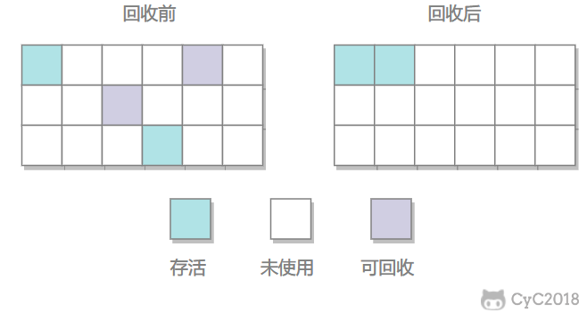

# 1 类的生命周期
类的完整生命周期：

系统加载 Class 类型的文件主要三步:**加载->连接->初始化**。连接过程又可分为三步:验证->准备->解析。

1. 加载
   1. 通过全类名获取定义此类的二进制字节流
   2. 将字节流代表的静态存储结构转换为方法区的运行时数据结构
   3. 在内存中生成一个代表此类的 Class 对象，作为方法区这些数据的访问入口
   
   加载阶段和连接阶段部分内容是交叉进行的，加载还没结束时，连接阶段可能就已经开始了。
2. 验证   
   
3. 准备   
   准备阶段正式**为类变量分配内存**并设置类变量初始值。
4. 解析   
  解析阶段是虚拟机将常量池内的符号引用替换为直接引用的过程。 
     - 符号引用就是一组符号来描述目标，可以是任何字面量。
     - 直接引用就是直接指向目标的指针、相对偏移量或一个间接定位到目标的句柄。
5. 初始化   
   初始化是类加载的最后一步，也是真正执行类中定义的 Java 程序代码(字节码)，初始化阶段是执行类构造器 `clinit()` 方法的过程。
6. 卸载   
   卸载类即该类的Class对象被GC。
   
   卸载类要满足三个要求：
    1. 该类的所有实例化对象都已被 GC，堆中不存在该类的实例对对象。
    2. 该类没有在其他任何地方被引用.
    3. 该类的类加载器的实例已被 GC.
# 2 Java 对象的创建过程
类加载检查 --> 分配内存 --> 初始化零值 --> 设置对象头 --> 执行 `init` 方法
1. 类加载检查   
检查 new 指令对应的参数是都能在常量池中定位到这个类的符号引用，并检查这个符号引用代表的类是都被加载过，如果没有，则先进行类加载过程。
2. 分配内存   
为新生对象分配内存
3. 初始化零值   
   将分配的内存空间都初始化为零值（除了对象头），保证对象的实例字段在代码中可以不赋初始值就直接使用。
4. 设置对象头   
   设置对象头，如对象是哪个类的实例、如何能找到类的元数据信息、对象的哈希码等等。
5. 执行 `init` 方法   
   此时从虚拟机的角度看，新的对象已经产生了，这一步执行 `init` 方法将对象按照程序员的意愿初始化。
# 3 引用
1. 强引用（StrongReference） 必不可少   
平常使用的引用，如果一个对象有强引用，垃圾回收器绝不会收它，即使内存不足抛出 `OutOfMemoryError` 也不会回收。
2. 软引用（SoftReference） 可有可无   
   如果一个对象只具有软引用，那么当内存空间不足时，会被回收。   
   软引用可用来实现内存敏感的高速缓存。
3. 弱引用（WeakReference） 可有可无   
   弱引用比软引用的对象生命周期更短暂。只要垃圾回收器的线程发现了只具有弱引用的对象，不管空间是否足够都会回收它。   
   不过垃圾回收器的线程优先级很低，不一定能很快发现这些对象。
4. 虚引用（PhantomReference）   
   ⼀个对象仅持有虚引⽤，那么它就和没有任何引⽤⼀样，在任何时候都可能被垃圾回收。
# 3 垃圾回收
垃圾收集主要是针对堆和方法区进行。程序计数器、虚拟机栈和本地方法栈这三个区域属于线程私有的，只存在于线程的生命周期内，线程结束之后就会消失，因此不需要对这三个区域进行垃圾回收。
## 判断一个对象是否可被回收
1. 引用计数算法   
   为对象添加一个引用计数器，增加引用时计数器加 1，引用失效时计数器减 1，引用计数为 0 的对象可被回收。   
   缺点：两个对象循环引用时，引用计数器永不为 0，无法被回收。因此 Java 虚拟机中不适用该方法。
2. 可达性分析算法   
   以 GC Roots 为起始点进行搜索，可达的对象都是存活的，不可达的对象可被回收。   
   Java 虚拟机使用该算法来判断对象是否可被回收，GC Roots 一般包含以下内容：
   - 虚拟机栈中局部变量表中引用的对象
   - 本地方法栈中 JNI 中引用的对象
   - 方法区中类静态属性引用的对象
   - 方法区中的常量引用的对象

## 垃圾收集算法
1. 标记-清除   
      
   在标记阶段，程序会检查每个对象是否为活动对象，如果是活动对象，则程序会在对象头部打上标记。
   
   在清除阶段，会进行对象回收并取消标志位，另外，还会判断回收后的分块与前一个空闲分块是否连续，若连续，会合并这两个分块。回收对象就是把对象作为分块，连接到被称为 “空闲链表” 的单向链表，之后进行分配时只需要遍历这个空闲链表，就可以找到分块。

   缺点：
   - 标记和清楚效率都不高
   - 会产生大量不连续的内存碎片，导致无法给大对象分配内存
2. 标记-整理   
      
    让所有存活的对象都向一端移动，然后直接清理掉端边界以外的内存。

    不会产生碎片，但需要移动大量对象，处理效率较低。   
3. 复制   
      
    将内存划分为大小相等的两块，每次只使用其中一块，当这一块内存用完了就将还存活的对象复制到另一块上面，然后再把使用过的内存空间进行一次清理。

    主要不足是只使用了内存的一半。

    现在的商业虚拟机都采用这种收集算法回收**新生代**，但是并不是划分为大小相等的两块，而是一块较大的 Eden 空间和两块较小的 Survivor 空间，每次使用 Eden 和其中一块 Survivor。在回收时，将 Eden 和 Survivor 中还存活着的对象全部复制到另一块 Survivor 上，最后清理 Eden 和使用过的那一块 Survivor。

4. 分代收集   
   现在的商业虚拟机采用分代收集算法，它根据对象存活周期将内存划分为几块，不同块采用适当的收集算法。

    一般将堆分为新生代和老年代。
    - 新生代：复制算法
    - 老生代：标记-清除 或者 标记-整理