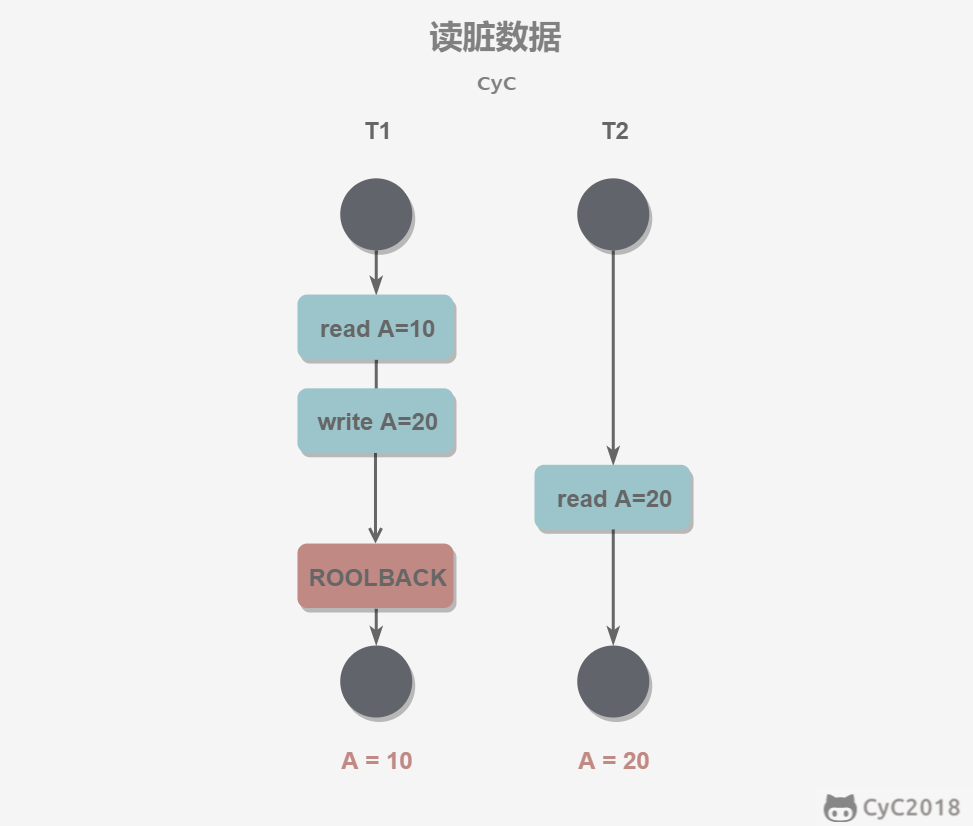
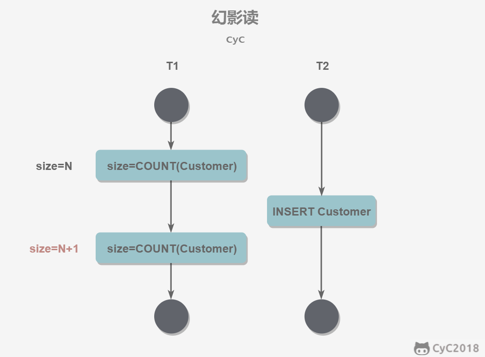

# 1 事务
## 概念和特性
事务是逻辑上的一组操作，要么都执行，要么都不执行。满足 ACID 四大特性。

事务的四大特性：
1. **原子性（Atomcity）**：事务是最小的执行单位，不允许分割。事务的所有操作要么全部提交成功，要么全部失败回滚。
2. **一致性（Consistency）**：执行事务前后，数据保持一致。在一致性状态下，所有事物对数据的读取结果都是相同的。
3. **隔离性（Isolation）**：并发访问数据库时，一个事务不被其他事务干扰。
4. **持久性（Durability）**：一旦事务提交，对数据的改变是持久的，及时数据库发生故障，事务执行的结果也不能丢失。

MySQL 默认采用自动提交模式，如果不显示使用 `START TRANSACTION` 语句来开始一个事务，那么每个查询操作都会被当作一个事务自动提交。
## 并发一致性问题
在并发环境下，事物的隔离性很难保证，因此可能会导致并发一致性问题。
### 脏读（Dirty read）
在不同的事务下，当前事务读到了另外事务未提交的数据。例如 T1 修改了一个数据但未提交，随后 T2 读了这个数据。如果 T1 撤销了修改，那么 T2 依据脏数据的操作是不正确的。

### 丢失修改（Lost to modify）
一个事务的更新操作被另一个事务的更新操作替换。例如： T1 读取 数据 A=20，T2 也读取 A=20,T1 修改 A = A - 1，T2 也修改 A = A - 1，最终结果 A = 19，T1 的修改被丢失了。

### 不可重复读（Unrepeatableread）
指在一个事务内多次读同一数据。在这个事务还没有结束时，另一个事务也访问该数据。那么，在第一个事务中的两次读数据之间，由于第二个事务的修改导致第一个事务两次读取的数据可能不太一样。

### 幻读（Phantom read）
幻读与不可重复读类似，T1 读取某个范围的数据，T2 在这个范围内插入新的数据，T1 再次读取这个范围的数据，此时读取的结果和和第一次读取的结果不同。

## 事务隔离级别
1. 未提交读（READ-UNCOMMITTED）：事务中的修改，即使没有提交，对其他事务也是可见的。可能导致脏读、幻读和不可重复读。
2. 提交读（READ COMMITTED）：一个事务所做的修改在提交之前对其它事务是不可见的。可以阻止脏读。
3. 可重复读（REPEATABLE READ）：保证在同一事务中多次读取同一数据的结果是一样的。可阻止脏读和不可重复读。
4. 可串行化（SERIALIZABLE）：强制事务串行执行，事务依次执行就不会出现并发一致性问题。该隔离级别需要加锁实现。

MySQL InnoDB 存储引擎默认支持的隔离级别是可重复读。InnoDB 存储引擎在分布式事务的情况下一般会用到可串行化隔离级别。

# 2 索引
一个索引是存储的表中一个特定列的**值数据结构**，提升查找的性能，存储了某一列的值以及指向表中相应行的指针。类别于一本书的目录以及页码。

MySQL 索引使用的数据结构主要有 **BTree 索引** 和 **哈希索引**。

哈希索引底层就是哈希表，在绝大多数需求为单条记录查询的时候，可以选择哈希索引，查询性能最快。其余大部分场景则建议选择 BTree 索引。
## B+Tree
B Tree 指的是 Balance Tree，即平衡树。平衡树是一颗查找树，并且所有叶子节点都在同一层。

B+ Tree 是基于 B Tree 和叶子节点顺序访问指针进行实现，具有 B Tree 的平衡性，通过顺序访问指针提高区间查询的性能。