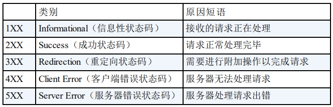

# 网络体系结构


# HTTP
## HTTP 状态码


## GET 和 POST
GET 用于获取资源，POST 用于传输实体主体。

GET 的参数是以查询字符串出现在 URL 中，参数中的非 ASCII 码会首先转码。POST 的参数存储在实体主体中。都可以被抓包查看
## 短连接与长连接
长连接只需要建立一次 TCP 连接就可以进行多次 HTTP 通信。
- 从 HTTP/1.1 开始默认是长连接的，如果要断开连接，需要客户端或服务器提出断开。使用 `Connection: close` 。
- HTTP/1.1 之前默认是短连接，如果需要长连接，则使用 `Connection: Keep-Alive` 。
## Cookie
HTTP 协议是无状态的，主要是为了尽可能简单，能够处理大量事务。HTTP/1.1 引入 Cookie 来保存状态信息。

Cookie 是服务器发送给用户浏览器并保存在本地的一小块数据。之后浏览器向同一服务器发请求时带上，标志该请求是来自同一浏览器。

1. 主要用途：
   1. 会话状态管理（如用户登陆状态，购物车等需要记录的信息）
   2. 个性化设置（用户自定义设置，主题等）
   3. 浏览器行为跟踪（跟踪分析用户行为）
2. 创建过程
   
   服务端发送的响应报文包含 Set-Cookie 首部字段，客户端吧 Cookie 内容保存到浏览器。

   客户端之后发送请求时，取出 Cookie 并通过 Cookie 请求首部字段发送给服务器。
3. 分类
   1. 会话期 Cookie：浏览器关闭后自动删除
   2. 持久性 Cookie：指定过期时间(Expires)或有效期（max-age)。
        ```
            Set-Cookie: id=a3fWa; Expires=Wed, 21 Oct 2015 07:28:00 GMT;
        ```
4. JavaScript
   浏览器通过 `document.cookie` 属性可创建新的 Cookie，也可以通过该属性访问非 HttpOnly 标记的 Cookie： `console.log(document.cookie)`。
5. HttpOnly：标记 Cookie，不能被 JavaScript 脚本调用。一定程度上避免 XSS 攻击。
6. Secure：标记为 Secure 的 Cookie 只能通过被 HTTPS 协议加密过的请求发送给服务端。但即使这样也无法保证安全性。敏感信息不应该通过 Cookie 传输。
## Session
Session 存储在服务算，更加安全。可以存储在服务器上的文件、数据库或内存中。也可以存储在 Redis 这种内存型数据库，效率更高。

Cookie 和 Session 的选择：
- Cookie 只能存储 ASCII 码， Session 支持任何类型的数据，考虑数据复杂性时首选 Session。
- Cookie 容易被恶意查看，非要存敏感数据时，可以将其加密，在服务端解密。
- 大型网站所有用户信息都存储在 Session 中开销是非常大的，不建议将所有的用户信息都存在 Session 中。
# HTTPS
HTTPS 密钥协商部分：


拓展阅读：[Diffie–Hellman 密钥交换协议](https://blog.csdn.net/zzminer/article/details/8571289)
# TCP
## TCP 的三次握手：


为什么要使用三次握手？
   三次握手最主要的目的就是双方确认自己与对方的发送与接收是正常的。
   - 第一次握手：Client 什么都不能确认；Server 确认了对方发送正常，自己接收正常
   - 第二次握手：Client 确认了：自己发送、接收正常，对方发送、接收正常；Server 确认了：对方发送正常，自己接收正常
   - 第三次握手：Client 确认了：自己发送、接收正常，对方发送、接收正常；Server 确认了：自己发送、接收正常，对方发送、接收正常

## 四次挥手


断开一个 TCP 连接则需要“四次挥手”：
   - 客户端-发送一个 FIN，用来关闭客户端到服务器的数据传送
   - 服务器-收到这个 FIN，它发回一 个 ACK，确认序号为收到的序号加1 。和 SYN 一样，一个 FIN 将占用一个序号
   - 服务器-关闭与客户端的连接，发送一个FIN给客户端
   - 客户端-发回 ACK 报文确认，并将确认序号设置为收到序号加1

任何一方都可以在数据传送结束后发出连接释放的通知，待对方确认后进入半关闭状态。当另一方也没有数据再发送的时候，则发出连接释放通知，对方确认后就完全关闭了TCP连接。

举个例子：A 和 B 打电话，通话即将结束后，A 说“我没啥要说的了”，B回答“我知道了”，但是 B 可能还会有要说的话，A 不能要求 B 跟着自己的节奏结束通话，于是 B 可能又巴拉巴拉说了一通，最后 B 说“我说完了”，A 回答“知道了”，这样通话才算结束。

## TCP协议如何保证可靠传输
   - 应用数据被**分割**成 TCP 认为最适合发送的数据块。
   - TCP 给发送的每一个包进行**编号**，接收方对数据包进行排序，把有序数据传送给应用层。
   - 校验和： TCP 将保持它首部和数据的**检验和**。这是一个端到端的检验和，目的是检测数据在传输过程中的任何变化。如果收到段的检验和有差错，TCP 将丢弃这个报文段和不确认收到此报文段。
   - TCP 的接收端会**丢弃重复的数据**。
   - 流量控制： TCP 连接的每一方都有固定大小的缓冲空间，TCP的接收端只允许发送端发送接收端缓冲区能接纳的数据。当接收方来不及处理发送方的数据，能提示发送方降低发送的速率，防止包丢失。TCP 使用的流量控制协议是可变大小的滑动窗口协议。 （TCP **利用滑动窗口实现流量控制**）
   - **拥塞控制**： 当网络拥塞时，减少数据的发送。
   - **ARQ协议**： 也是为了实现可靠传输的，它的基本原理就是每发完一个分组就停止发送，等待对方确认。在收到确认后再发下一个分组。
   - **超时重传**： 当 TCP 发出一个段后，它启动一个定时器，等待目的端确认收到这个报文段。如果不能及时收到一个确认，将重发这个报文段。
### ARQ 协议
ARQ 协议：自动重传请求（Automatic Repeat-reQuest，ARQ），是 OSI 模型中数据链路层和传输层的纠错机制之一。通过使用确认和超时这两个机制，在不可靠服务的基础上实现可靠的信息传输。如果发送方在发送一段时间之内没有收到确认帧，通常会重新发送。

ARQ 包括停止等待 ARQ 协议和连续 ARQ 协议。
### 拥塞控制
TCP的拥塞控制采用了四种算法，即 慢开始 、 拥塞避免 、快重传 和 快恢复。
- 慢开始： 慢开始算法的思路是当主机开始发送数据时，如果立即把大量数据字节注入到网络，那么可能会引起网络阻塞，因为现在还不知道网络的符合情况。经验表明，较好的方法是先探测一下，即由小到大逐渐增大发送窗口，也就是由小到大逐渐增大拥塞窗口数值。cwnd初始值为1，每经过一个传播轮次，cwnd加倍。
- 拥塞避免： 拥塞避免算法的思路是让拥塞窗口cwnd缓慢增大，即每经过一个往返时间RTT就把发送放的cwnd加1.
- 快重传与快恢复： 在 TCP/IP 中，快速重传和恢复（fast retransmit and recovery，FRR）是一种拥塞控制算法，它能快速恢复丢失的数据包。没有 FRR，如果数据包丢失了，TCP 将会使用定时器来要求传输暂停。在暂停的这段时间内，没有新的或复制的数据包被发送。有了 FRR，如果接收机接收到一个不按顺序的数据段，它会立即给发送机发送一个重复确认。如果发送机接收到三个重复确认，它会假定确认件指出的数据段丢失了，并立即重传这些丢失的数据段。有了 FRR，就不会因为重传时要求的暂停被耽误。 　当有单独的数据包丢失时，快速重传和恢复（FRR）能最有效地工作。当有多个数据信息包在某一段很短的时间内丢失时，它则不能很有效地工作。

## TCP 和 UDP 的区别


# 各种协议与 HTTP 协议之间的关系


# 浏览器输入 URL 的过程


总体来说分为以下几个过程:
1. DNS解析
2. TCP连接
3. 发送HTTP请求
4. 服务器处理请求并返回HTTP报文
5. 浏览器解析渲染页面
6. 连接结束